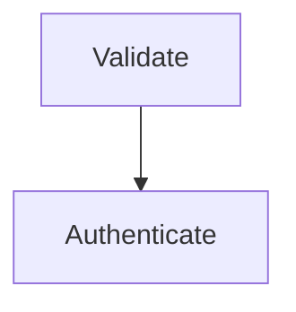

# Graph Diagrams

## Overview

Authors interactive HTML diagrams using Mermaid (flowchart, sequence, ER, `stateDiagram-v2`, mindmap, classDiagram, C4-as-flowchart) or Graphviz directed graphs via `.ve-graph`. Wires every node/edge as a clickable selection target, then opens via `amvcp-select.py` so the pick POSTs back to the agent.

## Prerequisites

Mermaid v11+ ESM CDN; Graphviz lazy-loaded via vendored viz.js on `.ve-graph`; Chromium (falls back to default); Python 3.12+ for `scripts/amvcp-select.py`.

## Instructions

1. **Pick engine** — Mermaid for ≤10 nodes; Graphviz `.ve-graph` for complex routing/math; hybrid for 15+.
2. **Mermaid**: v11 ESM, `theme:'base'`, `securityLevel:'loose'`, wrap in `.diagram-shell > .mermaid-wrap`.
3. **Graphviz**: drop DOT in `
`, paste cookbook defaults.
4. **Wire** — Mermaid: `click <id> call veSelectMermaid("id","label")`. Graphviz: prefix `id` with `ve-`.
5. **Set `--ve-accent` on `:root`**. Open: `python3 "$CLAUDE_PLUGIN_ROOT/scripts/amvcp-select.py" <file>.html`.

## Output

Self-contained `.html` in `$CLAUDE_PROJECT_ROOT/reports/visual-communicator/diagrams/`. Runner prints `{kind, count, selections:[...]}`.

## Error Handling

- **`stateDiagram-v2` parse fail** on parens/colons/` ` → use `flowchart TD`.
- **Mermaid `.node` collision** → scope under wrapper.
- **Graphviz faint** → paste cookbook `dpi=150,penwidth=2,fontsize=22,ranksep=1.6`. Single-backslash LaTeX in DOT silently stripped — double them.

## Examples

## Modes

This skill supports `data-ve-mode="readonly"` only. Mermaid/Graphviz graphs are explanatory — the per-element 3-state decision pill (R20-R23 of `amvcp-self-debug-rules`) does NOT apply to nodes/edges.

## Composability

Composes with every other amvcp-* skill on the same page (R22). Multiple graphs coexist independently. The only exclusive skill is the overlay-runtime (R24).

## Resources

- [interactive-selection-base.md](../../references/interactive-selection-base.md) — READ FIRST. runtime contract
  - How it works & Page Setup
  - The selection payload
  - Selectable Elements
  - Engine routing — read this BEFORE generating a graph
  - Runtime & Process Caveats
- [diagram-types.md](../../references/diagram-types.md) — Architecture · Flowcharts · Sequence · ER · State · Mindmaps · Class · C4
  - Diagrams (Mermaid + CSS)
  - Data Visualizations
  - Documentation Layouts
  - Prose Accent Elements
- [styling-guide.md](../../references/styling-guide.md) — Aesthetics · Typography · Color · Mermaid theming
  - Aesthetic directions
  - Typography & Color
  - Surfaces, Hierarchy & Animation
  - Engines & Illustrations
- [libraries.md](../../references/libraries.md) — Mermaid v11 ESM + ELK · `theme:'base'` · Google Fonts
  - Mermaid.js — Diagramming Engine
  - Chart.js — Data Visualizations
  - anime.js — Orchestrated Animations
  - Google Fonts — Typography
- [mermaid-integration.md](./references/mermaid-integration.md) — `click` + `veSelectMermaid()` wiring
  - Wiring Mermaid clicks to the selection runtime
- [graphviz-cookbook.md](./references/graphviz-cookbook.md) — Defaults · IDs · Math · `rankdir` · `.ve-graph` CSS
  - Graphviz defaults
  - IDs on nodes and edges
  - Math labels in DOT
  - Choosing `rankdir`
  - Forcing layer alignment
  - Page CSS requirements for `.ve-graph`
  - What the runtime gives you for free
  - Directed graphs (Graphviz / `.ve-graph`)
  - Math labels in graphs (LaTeX, not ASCII)
  - Engine selection
  - The manual-grid escape hatch
  - When to use which engine
