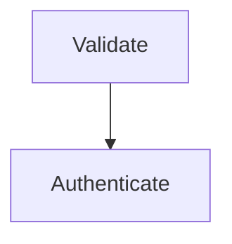

# Graph Diagrams

## Overview

Authors interactive HTML diagrams using Mermaid (flowchart, sequence, ER, `stateDiagram-v2`, mindmap, classDiagram, C4-as-flowchart) or Graphviz directed graphs via `.ve-graph`. Wires every node/edge as a clickable selection target, then opens via `amvcp-select.py` so the pick POSTs back to the agent.

## Prerequisites

- Mermaid v11+ via jsdelivr ESM CDN.
- Graphviz: `amvcp-runtime.js` lazy-loads vendored viz.js when `.ve-graph` exists.
- Chromium browser (falls back to default with copy-paste overlay).
- Python 3.12+ for `scripts/amvcp-select.py`.

## Instructions

1. **Pick the engine** — Mermaid for ≤10-node diagrams; Graphviz `.ve-graph` for complex routing, math, many-to-many; CSS Grid for rich content; hybrid (Mermaid + cards) for 15+ elements.
2. **Pick an aesthetic** from the styling guide; vary per generation.
3. **Mermaid**: load v11 ESM CDN, init `theme:'base'` + `securityLevel:'loose'`, wrap `<pre class="mermaid">` in `.diagram-shell > .mermaid-wrap`.
4. **Graphviz**: drop DOT into `<div class="ve-graph">…</div>` and apply the cookbook defaults block.
5. **Wire selection** — Mermaid: `click <id> call veSelectMermaid("id","label")` per node. Graphviz: prefix DOT `id` with `ve-` (auto `[data-ve-id]`); bare names auto-tagged from `<title>`.
6. **Set `--ve-accent` on `:root`** so hover glow inherits the page accent.
7. **Open via the runner**: `python3 "$CLAUDE_PLUGIN_ROOT/scripts/amvcp-select.py" <file>.html`.

## Output

Self-contained `.html` in `$CLAUDE_PROJECT_ROOT/reports/visual-communicator/diagrams/` with embedded styling and click wiring. Runner prints one-line JSON: `{kind:"submit"|"exit",count:N,selections:[...]}`.

## Error Handling

- **`stateDiagram-v2` parse failure** on labels with parens, colons, `<br/>`, HTML entities → use `flowchart TD` with `|"label"|`.
- **Mermaid CSS class collision**: page `.node` overrides Mermaid's SVG `.node` — scope under a wrapper.
- **No Chromium**: runner falls back to default browser; runtime shows "copy JSON" overlay.
- **Other anti-patterns**: `flowchart LR` >5 nodes (→ `TD`); bare `<pre class="mermaid">` no `.mermaid-wrap` (tiny); 15+ nodes (→ hybrid); Graphviz stock defaults faint (paste cookbook: `dpi=150`,`penwidth=2`,`fontsize=22`,`ranksep=1.6`); single-backslash LaTeX in DOT silently stripped — double them.

## Examples

**Mermaid with click wiring**



**Graphviz `.ve-graph`**

```html
<div class="ve-graph"><script type="text/vnd.graphviz">
digraph G{rankdir=LR;dpi=150;ranksep=1.6;
node[shape=circle,style=filled,penwidth=2,fontsize=22];
ve_a->ve_b;}</script></div>
```

## Resources

- [interactive-selection-base.md](../../references/interactive-selection-base.md) — READ FIRST. How it works · Boilerplate · Payload · Engine routing
- [diagram-types.md](../../references/diagram-types.md) — Architecture · Flowcharts · Sequence · ER · State · Mindmaps · Class · C4
- [styling-guide.md](../../references/styling-guide.md) — Aesthetics · Typography · Color · Mermaid theming
- [libraries.md](../../references/libraries.md) — Mermaid v11 ESM + ELK · `theme:'base'` · Google Fonts
- [mermaid-integration.md](./references/mermaid-integration.md) — `click` + `veSelectMermaid()` wiring
- [graphviz-cookbook.md](./references/graphviz-cookbook.md) — Defaults · IDs · Math · `rankdir` · `.ve-graph` CSS
