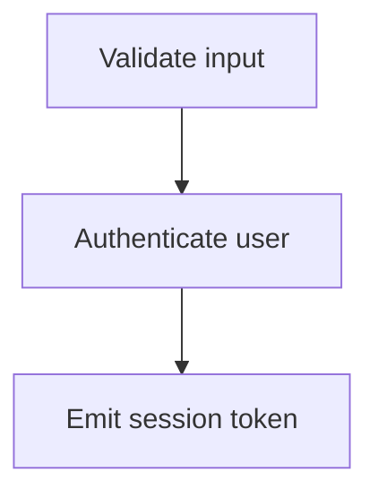

# Mermaid Integration

## Table of contents

- [Wiring Mermaid clicks to the selection runtime](#wiring-mermaid-clicks-to-the-selection-runtime)

How to make Mermaid diagram nodes selectable in pages generated by `ai-maestro-visual-communicator-plugin`. For the cross-cutting selection wire format, read `${CLAUDE_PLUGIN_ROOT}/references/interactive-selection-base.md` first.

---

## Wiring Mermaid clicks to the selection runtime

Mermaid renders SVG nodes that are not direct children of your HTML, so `data-ve-id` on the source node ID does not work. Use Mermaid's `click` directive to call into the runtime:

Add a `click` line for **every node the user might want to act on**. The first argument becomes the `id` (prefixed `ve-mermaid-`), the second becomes the `label`. Optional third argument is an extra-data object encoded as a JSON string.

For edges/arrows, the easiest pattern is to add an invisible label and `click` it the same way, or wrap the relevant node and call out the edge in `data` instead.
